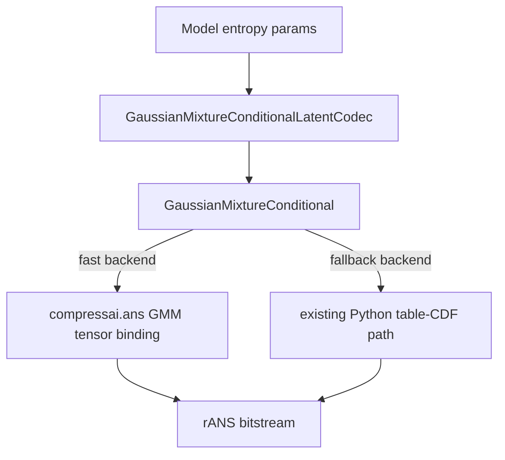

# FlashGMM → CompressAI Integration Plan

## 一句话结论

优先把 FlashGMM 作为 `GaussianMixtureConditional` 的 fast rANS backend 集成，而不是先迁移 CKBD/ELIC 模型本身。当前仓库已经有 GMM entropy model；真正值得迁的是 FlashGMM 在 C++ rANS 中直接基于 `(symbol, scales, means, weights)` 做近似 CDF + binary search decode，避免 Python 端为每个 symbol 构建 CDF table。

## Scope

### In scope

1. C++ rANS GMM fast path：`encode_with_indexes_gmm` / `decode_with_indexes_gmm` / `decode_stream_gmm`。
2. `GaussianMixtureConditional.compress/decompress` 使用 fast path，并保留现有 table-CDF path 作为 fallback / 对照。
3. 新增可复用的 `GaussianMixtureConditionalLatentCodec`，用于 checkerboard/channel-group latent codecs。
4. 可选新增 GMM 版本模型：`cheng2020-anchor-checkerboard-gmm`、`elic2022-gmm`。
5. Linux/x86_64 correctness + benchmark 测试。

### Out of scope for first PR

1. FlashGMM 的训练脚本、eval 脚本整体迁移。
2. pretrained weight mirror / zoo pretrained URL。
3. macOS arm64 编译支持；Mac 只保证非扩展路径不坏。
4. CUDA kernel 化；FlashGMM 当前核心实际是 CPU rANS + SIMD approximate CDF。

## Current state

### CompressAI side

- `compressai/entropy_models/entropy_models.py` 已有 `GaussianMixtureConditional`。
- 当前 GMM `compress/decompress` 走 Python `_build_cdf()`，再调用普通 `encode_with_indexes` / `decode_with_indexes`。
- `compressai/cpp_exts/rans/rans_interface.{cpp,hpp}` 目前没有 GMM tensor binding。
- `compressai/latent_codecs/` 没有通用 `GaussianMixtureConditionalLatentCodec`。
- `compressai/models/sensetime.py` 已有 Gaussian 版本 `cheng2020-anchor-checkerboard` 与 `elic2022-official`。

### FlashGMM side

- 核心文件：
  - `/Users/boyce/Program/FlashGMM/compressai/cpp_exts/rans/rans_interface.cpp`
  - `/Users/boyce/Program/FlashGMM/compressai/cpp_exts/rans/rans_interface.hpp`
  - `/Users/boyce/Program/FlashGMM/compressai/cpp_exts/rans/avx_mathfun.h`
  - `/Users/boyce/Program/FlashGMM/compressai/entropy_models/entropy_models.py`
- 新 C++ API 支持 K=1..8 runtime dispatch。
- Runtime env：
  - `APPROX_MODE=0|1|2`：选择 Gaussian CDF approximation。
  - `USE_SIMD=0|1`：开关 SIMD path。
- 上游 `GaussianMixtureConditionalLatentCodec` 有 debug `print()`，缺少 `@register_module`，不能直接照搬。
- 上游 `elic_gmm.py` 把 GMM 模型注册成 `elic2022-official`，会与当前仓库冲突，必须改名。

## Recommended migration shape



核心设计是：Python 层 API 尽量保持现有 CompressAI 语义，C++ fast path 只是 `GaussianMixtureConditional` 内部 backend。这样已有使用 GMM 的模型也能受益，不必每个模型单独接 FlashGMM。

## Phase 1 — C++ fast GMM backend

### Files to change

- `/Users/boyce/Program/CompressAI/compressai/cpp_exts/rans/rans_interface.hpp`
- `/Users/boyce/Program/CompressAI/compressai/cpp_exts/rans/rans_interface.cpp`
- `/Users/boyce/Program/CompressAI/compressai/cpp_exts/rans/avx_mathfun.h`（新增，从 FlashGMM 迁入）
- `/Users/boyce/Program/CompressAI/setup.py`
- `/Users/boyce/Program/CompressAI/pyproject.toml`（如使用 isolated build，需要加入 torch build requirement；若只用 no-build-isolation，可先不加）

### Work items

1. 只迁 GMM 必需 API，不迁 FlashGMM 里额外的 single-Gaussian overload，减少 surface area。
2. 在 `RansEncoder` / `BufferedRansEncoder` 加：
   - `encode_with_indexes_gmm(symbols, scales, means, weights, max_value, K=4)`
3. 在 `RansDecoder` 加：
   - `decode_with_indexes_gmm(encoded, scales, means, weights, max_bs_value, K=4)`
   - `decode_stream_gmm(scales, means, weights, max_bs_value, K=4)`
4. 迁入 `_fast_gaussian_cdf` / `_fast_gmm_cdf` / approximation dispatch / SIMD dispatch。
5. K runtime dispatch 保持 1..8；K 超界 Python 层 fallback。
6. rANS extension 改用 `torch.utils.cpp_extension.CppExtension` / `BuildExtension`，因为 pybind 要接 `torch::Tensor`。
   - `_CXX` ops extension 仍可保持 `Pybind11Extension`，不必一刀切改掉。
7. Linux 编译参数第一版可按 FlashGMM 使用 `-O3 -march=native`；如果后续要发 wheel，再补 `COMPRESSAI_USE_NATIVE_ARCH` 或 AVX compile guard。

### Acceptance criteria

- Linux/x86_64 下 `from compressai import ans` 成功。
- `hasattr(ans.RansEncoder, "encode_with_indexes_gmm")` 为 True。
- K=1/2/3/4/8 的 encode-decode roundtrip 全部恢复原 symbols。
- `decode_with_indexes_gmm` 与 `decode_stream_gmm` 输出一致。

## Phase 2 — Wire into `GaussianMixtureConditional`

### Files to change

- `/Users/boyce/Program/CompressAI/compressai/entropy_models/entropy_models.py`

### Design

新增 backend 选择，但默认在 Linux 有 binding 时用 fast path：

```python
GaussianMixtureConditional(
    K=4,
    gmm_coding_backend="auto",  # auto | flash | table
)
```

建议行为：

- `auto`：若 `compressai.ans` 有 GMM binding 且 `1 <= K <= 8`，用 flash；否则用 table。
- `flash`：强制用 FlashGMM binding；缺 binding 直接报清晰错误。
- `table`：保持现有 Python CDF table 行为，作为 correctness 对照和 fallback。

### Implementation details

1. 保留现有 `_build_cdf()`，不要删除。它是 fallback，也方便回归测试。
2. 把现有 `compress/decompress` 拆成：
   - `_compress_table()` / `_decompress_table()`
   - `_compress_flash()` / `_decompress_flash()`
3. `reshape_entropy_parameters()` 输出要规范化为：
   - `symbols`: `(num_symbols,) int32 CPU contiguous`
   - `scales/means/weights`: `(num_symbols, K) float32 CPU contiguous`
4. 避免上游临时代码：
   - 不保留 `self.y_q` / `self.y_p` debug state。
   - 不使用 `print()`。
   - 不对输入参数做危险 in-place mutation（例如 `means += abs_max`、`clamp_` 只在局部 copy 上做）。
5. `abs_max` / `zero_bitmap` bitstream metadata 结构保持当前 API：`(rv, abs_max, zero_bitmap)`，避免上层 codec 破坏。
6. 明确注释：Flash fast path 产生的 bitstream 不要求与 table backend byte-identical，只要求同 backend encode/decode 可逆；rate 需要单独 benchmark。

### Acceptance criteria

- 现有 `tests/test_entropy_models.py::TestGaussianMixtureConditional` 不退化。
- 新增 GMM compress/decompress roundtrip 测试通过。
- `backend="table"` 和 `backend="flash"` 对同一随机 latent 都能 roundtrip。

## Phase 3 — Add reusable GMM latent codec

### Files to change

- `/Users/boyce/Program/CompressAI/compressai/latent_codecs/gaussian_mixture_conditional.py`（新增）
- `/Users/boyce/Program/CompressAI/compressai/latent_codecs/__init__.py`
- `/Users/boyce/Program/CompressAI/compressai/latent_codecs/checkerboard.py`

### `GaussianMixtureConditionalLatentCodec`

从 FlashGMM 迁思想，不原样搬代码：

- 加 `@register_module("GaussianMixtureConditionalLatentCodec")`。
- 加 `__all__`。
- 删除所有 timing/debug `print()`。
- 支持 `chunks=("scales", "means", "weights")`。
- 支持 quantizer：
  - `noise`
  - `weighted_mean_ste`
  - `dominant_mean_ste`
- `_reshape_gmm_weight()` 对 K 维 softmax，输入/输出布局保持 CompressAI 当前 `GaussianMixtureConditional` 期望的 `[K0*C, K1*C, ...]`。

### Checkerboard support

当前 `CheckerboardLatentCodec` 默认假设 inner latent codec 的 entropy params 是 `2*C`（scale/mean）。GMM 需要 `3*K*C`。建议做一个小接口，避免把 `gmm_k` 写死到 checkerboard：

- `GaussianConditionalLatentCodec.param_channels_multiplier = 2`
- `GaussianMixtureConditionalLatentCodec.param_channels_multiplier = 3 * K`
- 可选：inner codec 提供 `quantization_center(params)`：
  - Gaussian 返回 `means`
  - GMM 返回 weighted mean 或 dominant mean

这样 checkerboard twopass 只依赖 inner codec 的能力，不需要到处判断 `if GMM`。

### Acceptance criteria

- `GaussianMixtureConditionalLatentCodec` 可通过 registry 构造。
- checkerboard onepass/twopass 在 Gaussian 原行为不变。
- GMM checkerboard forward/compress/decompress smoke 通过。

## Phase 4 — Optional model-level integration

这一步不是 fast backend 的必要条件，但能提供 FlashGMM 论文里的直接模型入口。

### Files to change

- `/Users/boyce/Program/CompressAI/compressai/models/sensetime.py` 或新增 `/Users/boyce/Program/CompressAI/compressai/models/sensetime_gmm.py`
- `/Users/boyce/Program/CompressAI/compressai/models/__init__.py`
- `/Users/boyce/Program/CompressAI/compressai/zoo/image.py`
- `/Users/boyce/Program/CompressAI/compressai/zoo/__init__.py`
- `/Users/boyce/Program/CompressAI/tests/test_models.py`
- `/Users/boyce/Program/CompressAI/tests/test_zoo.py`

### Model entries

建议新增，不覆盖原名：

1. `@register_model("cheng2020-anchor-checkerboard-gmm")`
2. `@register_model("elic2022-gmm")`

不要使用 FlashGMM 的 `@register_model("elic2022-official")`，因为当前仓库已有 Gaussian 版本同名。

### Model changes

- CKBD GMM：把 final entropy-parameter output 从 `2*N` 改为 `3*K*N`，inner codec 换成 `GaussianMixtureConditionalLatentCodec(K=K)`。
- ELIC GMM：每个 group 的 param aggregation output 从 `2*group` 改为 `3*K*group`，inner codec 换成 GMM codec。
- `from_state_dict` 从最后一层输出通道反推 K：
  - CKBD：`K = out_channels // (3 * N)`
  - ELIC：`K = out_channels // (3 * group_channels)`

### Acceptance criteria

- 随机权重 forward smoke。
- 小尺寸 compress/decompress roundtrip。
- zoo factory smoke；`pretrained=True` 暂时按现有 candidate 习惯报 `not yet available`。

## Phase 5 — Tests and benchmarks

### New tests

1. `/Users/boyce/Program/CompressAI/tests/test_rans_gmm.py`
   - 直接从 FlashGMM 的 `test_gmm_codec.py` / `test_gmm_streaming.py` 改成 pytest。
   - 参数化 K：`1, 2, 3, 4, 8`。
   - 参数化 `APPROX_MODE`：至少 `0`，可加 `1/2` nightly。
   - 测 `decode_with_indexes_gmm` 和 chunked `decode_stream_gmm`。

2. `/Users/boyce/Program/CompressAI/tests/test_entropy_models.py`
   - 增加 `GaussianMixtureConditional.compress/decompress` roundtrip。
   - backend 参数化：`table`, `flash`。
   - 若无 GMM binding，`flash` 用 `pytest.skip`。

3. `/Users/boyce/Program/CompressAI/tests/test_latent_codecs.py` 或并入现有 model tests
   - `GaussianMixtureConditionalLatentCodec` forward/compress/decompress smoke。
   - Checkerboard + GMM smoke。

4. `/Users/boyce/Program/CompressAI/tests/test_models.py`
   - optional：GMM CKBD / ELIC 小模型 smoke。

### Benchmarks

新增一个轻量脚本，不放进默认 pytest：

- `/Users/boyce/Program/CompressAI/examples/bench_flash_gmm.py`

输出：

- table backend encode/decode time
- flash backend encode/decode time
- compressed byte length
- roundtrip correctness
- K / latent shape / APPROX_MODE / USE_SIMD / torch version / CPU model

### Linux verification command

```bash
uv run pytest \
  tests/test_rans_gmm.py \
  tests/test_entropy_models.py -k "GaussianMixtureConditional" \
  -q
```

不要跑 zoo pretrained 部分，符合项目约定。

## Risks and mitigations

### Risk 1: build backend gets heavier

`torch::Tensor` pybind 需要 torch extension build。`setup.py` 需要引入 `torch.utils.cpp_extension`，这会让 isolated build 更重。

Mitigation:
- 第一版在项目开发环境用 `uv pip install -e . --no-build-isolation` 或当前 `.venv` 编译。
- 如果要 PEP517 isolated build，再把 `torch` 加进 `[build-system].requires`。

### Risk 2: Flash backend bitstream not byte-compatible with table backend

FlashGMM 用近似 CDF + binary search，table backend 用显式 quantized CDF。两者不应要求 bitstream 一致。

Mitigation:
- 测试标准设为同 backend 可逆。
- benchmark 报告 compressed size 差异。
- 保留 `gmm_coding_backend="table"`，需要 exact table path 时可回退。

### Risk 3: approximate CDF edge cases

极小 scale、tail symbol、pmf=0 会触发 bypass。这里最容易出现 decode mismatch。

Mitigation:
- 参数测试覆盖 scale 下界附近、large symbols、K=1/8。
- 保持 `scale_bound` / clamp 与 Python GMM 语义一致。
- 对 C++ 输入强制 contiguous + dtype check。

### Risk 4: checkerboard twopass assumptions

现有 checkerboard codec 假设 inner entropy params 是 scale/mean。GMM 的 weighted mean quantization 需要额外接口。

Mitigation:
- 不把 GMM 逻辑硬塞进 checkerboard；让 inner codec 暴露 `param_channels_multiplier` 与 `quantization_center()`。

## Suggested PR slicing

### PR 1: Fast backend only

- C++ binding + setup change。
- `GaussianMixtureConditional` backend switch。
- `tests/test_rans_gmm.py` + GMM entropy roundtrip。

This is the highest ROI change.

### PR 2: Latent codec support

- `GaussianMixtureConditionalLatentCodec`。
- `CheckerboardLatentCodec` inner-codec interface。
- latent codec smoke tests。

### PR 3: Model entries

- `cheng2020-anchor-checkerboard-gmm`。
- `elic2022-gmm`。
- zoo registration and smoke tests。

## Open decisions

1. 是否第一版默认 `gmm_coding_backend="auto"`，还是先默认 `table`、通过 env/constructor 显式启用 `flash`？我的建议：默认 `auto`，但只有 binding 存在且 K<=8 才启用。
2. 是否把 `APPROX_MODE` / `USE_SIMD` 保持为 env var，还是增加 Python API？我的建议：第一版保持 env var，文档说明即可；避免 Python/C++ 配置状态不一致。
3. 是否迁 FlashGMM 的 CKBD/ELIC 权重转换脚本？我的建议：等 PR 1/2 稳定后再做，否则容易把 backend 集成和模型对齐混在一起。
